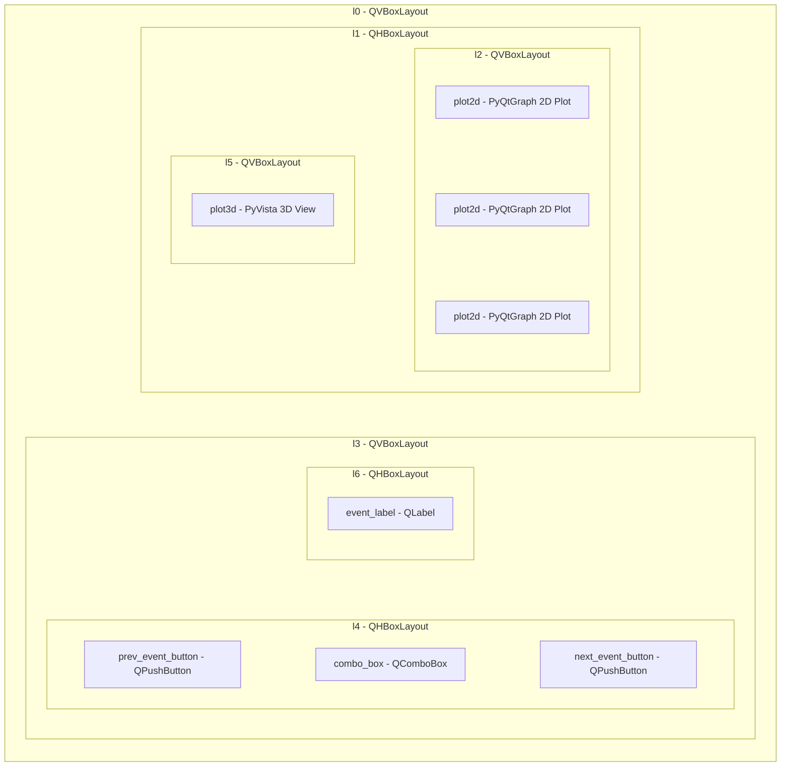

## Layout of the application

```mermaid
flowchart TB
    subgraph l0["l0 - QVBoxLayout"]
        direction TB
        subgraph l1["l1 - QHBoxLayout"]
            direction LR
            subgraph l5["l5 - QVBoxLayout"]
                direction TB
                plot3d["plot3d - PyVista 3D View"]
            end
            subgraph l2["l2 - QVBoxLayout"]
                direction TB
                plot2d_1["plot2d - PyQtGraph 2D Plot"]
                plot2d_2["plot2d - PyQtGraph 2D Plot"]
                plot2d_3["plot2d - PyQtGraph 2D Plot"]
                plot2d_1 ~~~ plot2d_2 ~~~ plot2d_3
            end
            l5 ~~~ l2
        end
        subgraph l3["l3 - QVBoxLayout"]
            direction TB
            subgraph l6["l6 - QHBoxLayout"]
                direction LR
                event_label["event_label - QLabel"]
            end
            subgraph l4["l4 - QHBoxLayout"]
                direction LR
                prev_event_button["prev_event_button - QPushButton"]
                combo_box["combo_box - QComboBox"]
                next_event_button["next_event_button - QPushButton"]
                prev_event_button ~~~ combo_box ~~~ next_event_button
            end
            event_label ~~~ l4
        end
        l1 ~~~ l3
    end
```